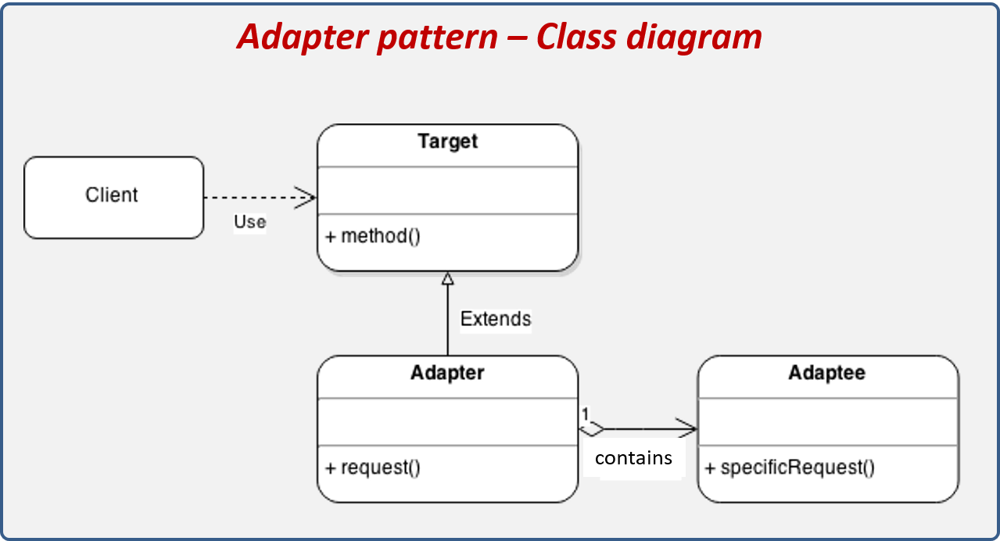
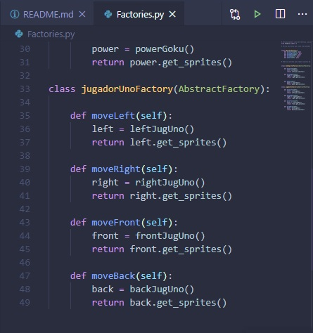
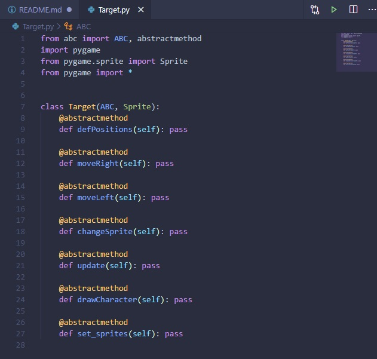

# Implementación del patrón ***Adapter*** en un videojuego :key:

## Desarrolladores :computer:
Este desarrollo fue realizado por 
> Julián Esteban Mendoza Wilches, 20182020054

> Reinaldo Espinel Torres, 20182020015

**Universidad Distrital Francisco José de Caldas**

**Modelos de Programación I**
 
**Docente**: Alejandro Paolo Daza

## Descripción
Este trabajo consiste en la implementación del patrón de diseño ***Adapter***. Antes de continuar, recordemos en que situaciones podemos usar este patron.

> El patrón de diseño Adapter es utilizado cuando tenemos interfaces de software incompatibles, las cuales a pesar de su incompatibilidad tiene una funcionalidad similar. Este patrón es implementado cuando se desea homogeneizar la forma de trabajar con estas interfaces incompatibles, para lo cual se crea una clase intermedia que funciona como un adaptador. Esta clase adaptador proporcionará los métodos para interactuar con la interface incompatible.

Esta es la estructura de adapter en diagrama de clases:



Donde:
- Target:  Interface que nos permitirá homogenizar la forma de trabajar con las interfaces incompatibles, esta interface es utilizada para crear los Adapter.
- Client:  Actor que interactua con el Adapter.
- Adapter: Representa la implementación del Target, el cual tiene la responsabilidad de mediar entre el Client y el Adaptee. Oculta la forma de comunicarse con el Adaptee.
- Adaptee: Representa la clase con interface incompatible.

Bien, despues de explicar un poco sobre adapter, vamos a describir el trabajo implementado:
Anteriormente se creo otro proyecto donde implementamos ***Builder*** y ***Abstract Factory***, para la creación de un personaje en un escenario, donde este se podia mover a la derecha e izquierda.
El trabajo del que acabamos de hablar se encuentra en el siguiente repo: 
> https://github.com/julianMendozaGg/SimplePythonGame

Ahora con colaboración de otro grupo de la materia (**Modelos de Programación**), intercambiamos nuestros personajes, ellos nos pasaron su personaje, el cual se encuentra en el repo como "jugador.py", nuestro objetivo es el de poder **adaptar** el personaje de ellos en nuestro juego.

## ¿Como lo hicimos?
1. Pasamos sus fabricas, productos y constructores a nuestro programa.(Esto no lo hicimos con adapter), solamente se cambiaron sus nombres y se juntaron con el resto de productos, fabricas y constructores.



2. Como existen 2 maneras de hacer adapter, una por composicion y otra por herencia, nos fuimos por el lado de composición.

3. Como vimos mas arriba el diagrama de clases en **adapter** empezamos a aplicar el patrón:

    1. Creamos nuestro **Target**, esta es la clase abstracta que usamos para crear el adapter, 

    

    **¿Por Qué estos metodos?**

    Bien, porque estos son los mismos metodos que usa nuestra clase **Character**, y nuestro cliente **Juego**, necesitara usar los metodos de la clase Character para que funcione nuestro programa, aca es onde logramos adapter, si adaptamos la clase  **jugador** que corresponde a la clase del personaje del otro grupo para que el cliente la use, lograremos adapter.

    2. Creamos nuestro adaptador el cual extiende de la clase abstracta para poder usar sus metodos, (**Es importante aclarar que porque usemos el concepto de herencia no significa que la implementación de este patron se realize por el metodo de herencia, tomemoslo como una implementación de una interfaz de java, ya que la composcion que aseguramos usar desde un principio viene despues.)

    ```Python

        from Target import *
        from jugador import *

        class JugadorAdapter(Target):

            def __init__(self):
                Sprite.__init__(self)
                self.auxJugador = Jugador()
                self.velocidad = self.auxJugador.velocidad
                self.sentido = self.auxJugador.sentido
                self.cont = self.auxJugador.cont

            def set_sprites(self,sprites):
                self.auxJugador.set_sprites(sprites)

            def defPositions(self, auxposX, auxPosY):
                self.posX = auxPosY
                self.posY = auxPosY

            def moveRight(self):
                self.auxJugador.mover_derecha()
                

            def moveLeft(self):
                self.auxJugador.mover_izquierda()
                

            def changeSprite(self):
                self.auxJugador.update()

            def update(self):
                self.moveLeft()
                self.moveRight()
                self.changeSprite()
                

            def drawCharacter(self, screen):
                self.auxJugador.draw(screen)
    ```
    Vemos que se comporta de la misma forma que **Character**

